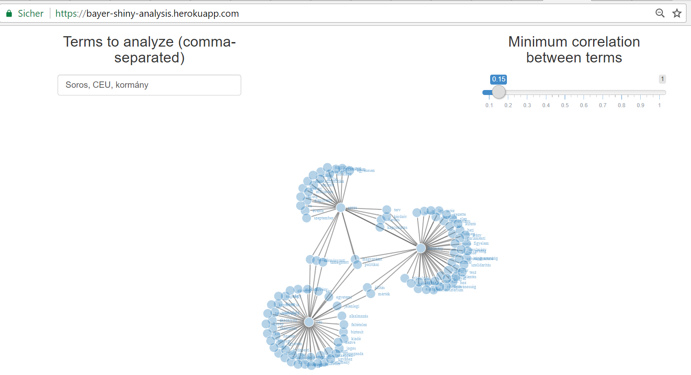

# Word Association Network of Blog Post from Zsolt Bayer
This repo contains the source code of an R Shiny app, which visualizes the word association network of Zsolt Bayer blog posts. To see it working, navigate to [https://bayer-shiny-analysis.herokuapp.com/](https://bayer-shiny-analysis.herokuapp.com/).

Text analysis was executed with [tidytext](https://github.com/juliasilge/tidytext) (script also available in the repo) and the bigram association network is visualized with [networkD3 for R](https://github.com/christophergandrud/networkD3). Deployment to Heroku happens through the [Heroku R buildpack](https://github.com/virtualstaticvoid/heroku-buildpack-r/tree/heroku-16).

The Python scraper producing 

## Content
### `Aptfile`
Ubuntu package names to install while deploying to Heroku.

### `init.R`
Installing R dependencies.

### `run.R`
Shiny `runApp` is invoked.

### `tm.R`
The part where text analysis is done.

### `app.R`
Shiny UI and server functionality lives here.